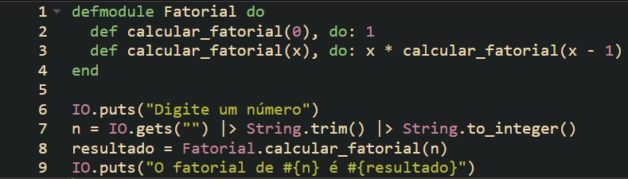
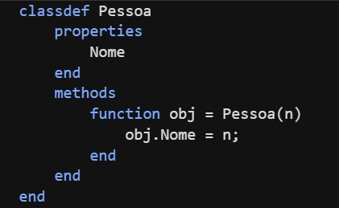
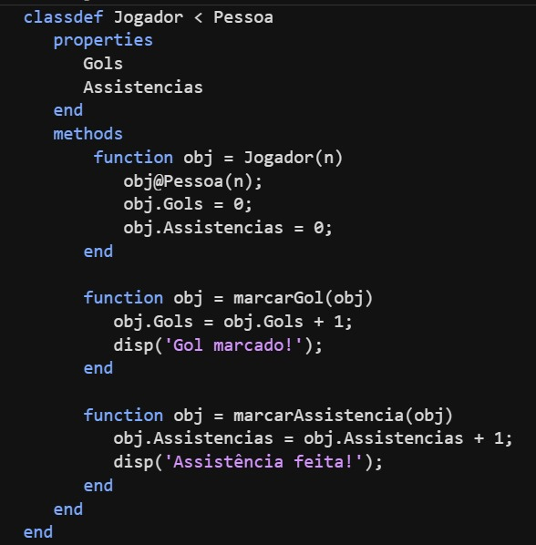
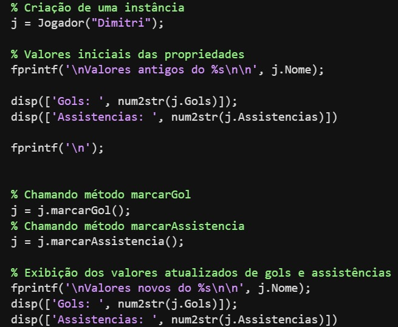
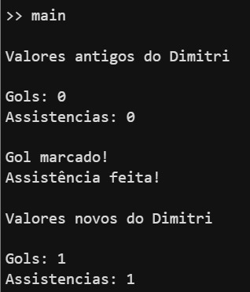

# Linguagens De Programação
**Grupo:** Andrei Alves Fracalossi, Pedro Henrique Santos dos Reis

**Linguagens e Paradigmas escolhidos:** Elixir (Funcional) e Matlab (Orientado a Objetos / Visual)

## 1. Elixir - Funcional

### O que é um Paradigma Funcional?
É uma fundamentação teórica e rigorosa, tornando um bom paradigma para prototipação e na área acadêmica.
- Resultados que dependem das entradas.
- Uso de funções ao invés de mudanças no estado do programa.
- Uso de RECURSÕES.
- Imutabilidade das variáveis.

### O que é a linguagem Elixir?
> Elixir é uma linguagem de programação funcional, concorrente, de propósito geral que executa na máquina virtual Erlang (BEAM). Elixir compila em cima de Erlang para fornecer aplicações distribuídas, em tempo real suave, tolerante a falhas, non-stop, mas também a estende para suportar metaprogramação com macros e polimorfismo via protocolos
 
> A linguagem de programação Elixir foi criada por José Valim, desenvolvida no hub de P&D da Plataformatec, uma subsidiária do Nubank. Seus objetivos foram permitir uma maior extensibilidade e produtividade no Erlang VM, mantendo a compatibilidade com ferramentas e ecossistema de Erlang.

### Exemplo

### 2. Matlab - Orientado a Objeto

### O que é um Paradigma Orientado a Objeto?
Contém a criação de CLASSES, OBJETOS E MÉTODOS no desenvolvimento do sistema.
- HERANÇA:  Reaproveitamento de código entre classes.
- ENCAPSULAMENTO: Não é necessário saber o “como”, apenas o “o que”.
- POLIMORFISMO: Métodos utilizados em diferentes objetos de diferentes classes.
- ABSTRAÇÃO: Incluir no sistema apenas o que interessa ao sistema.

### O que é a linguagem Matlab?
>MATLAB (MATrix LABoratory) trata-se de um software interativo de alta performance voltado para o cálculo numérico. O MATLAB integra análise numérica, cálculo com matrizes, processamento de sinais e construção de gráficos em ambiente fácil de usar, onde problemas e soluções são expressos somente como eles são escritos matematicamente, ao contrário da programação tradicional.

>MATLAB foi criado no fim dos anos 1970 por Cleve Moler, então presidente do departamento de ciência da computação da Universidade do Novo México. Ele logo se espalhou para outras universidades e encontrou um forte uso no âmbito da comunidade matemática aplicada.

### Exemplo

Classe Pessoa

Classe Jogador

Classe Main

Output

